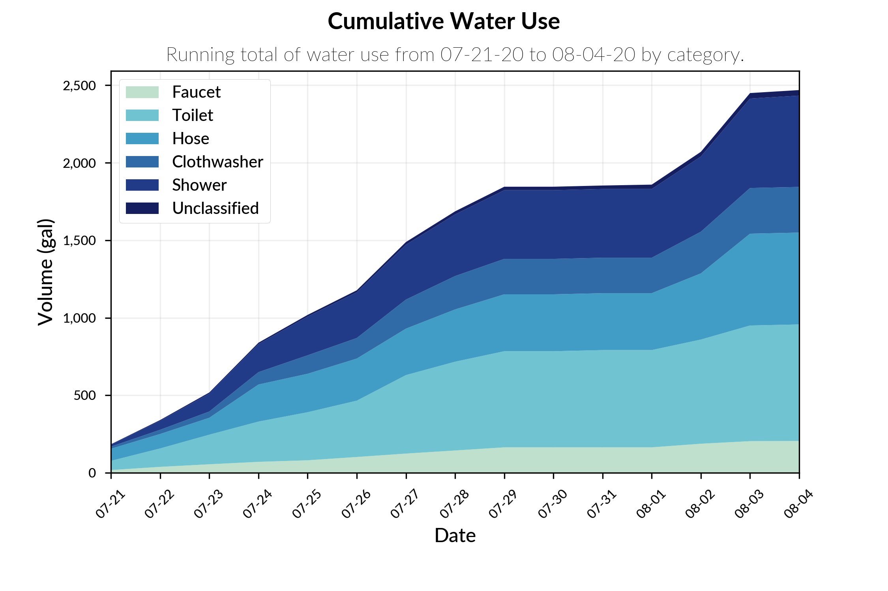
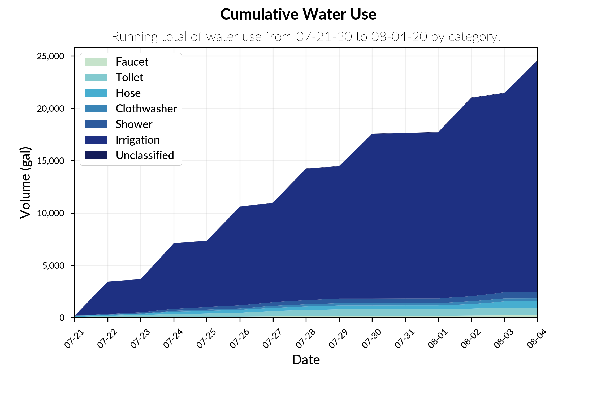
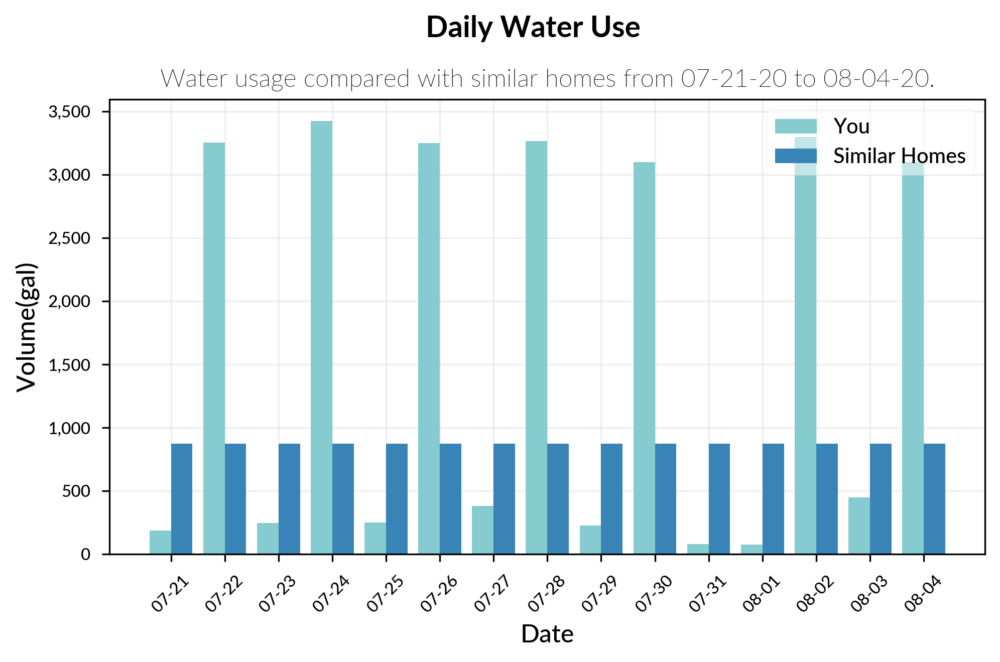
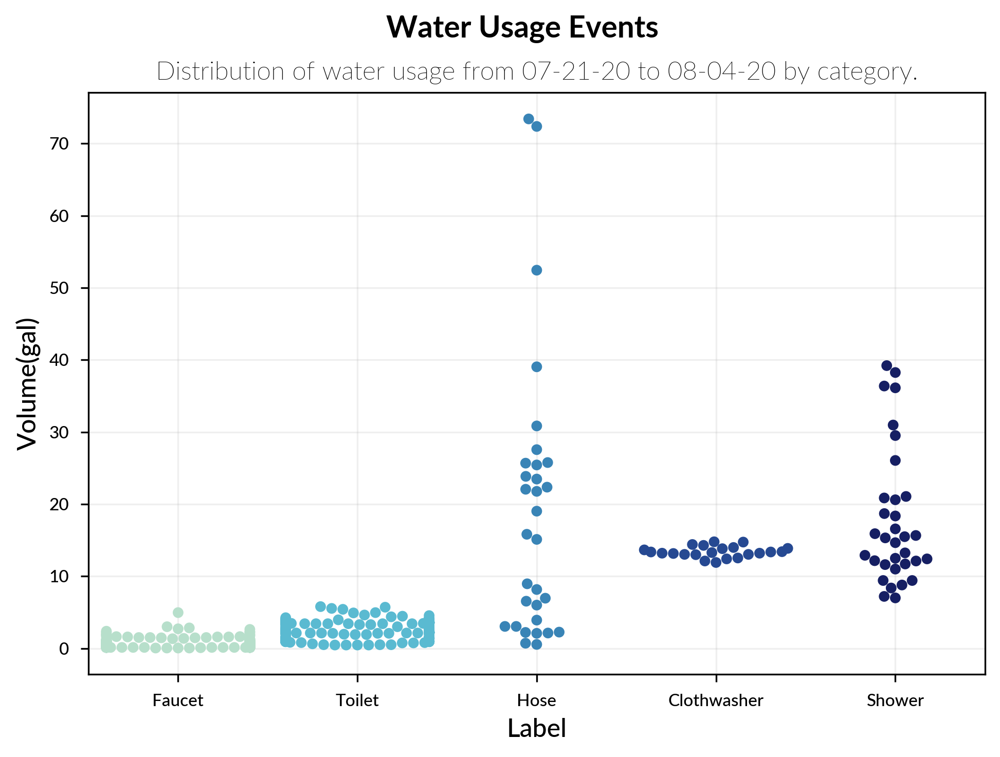
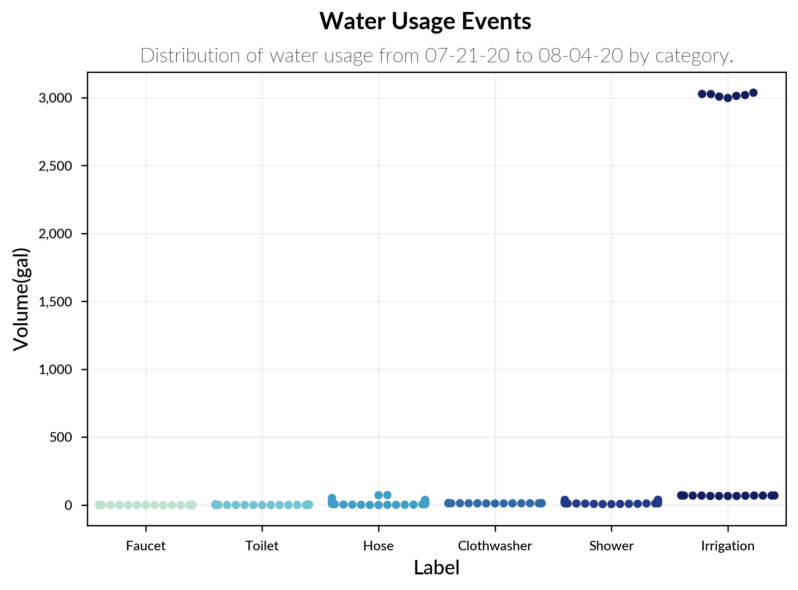

# Visualization Guide
A brief summary of the visualizations developed in the Jupyter Notebook, their intended use, and demonstration.

<!-- TABLE OF CONTENTS -->

  
Table of Contents

  <ol>
    <li><a href="#stacked-area-chart">Stack Area Chart</a>
    </li>
    <li><a href="#bar-plot-comparison">Bar Plot Comparison</a>
    </li>
    <li><a href="#raw-pulses-classification">Raw Pulses Classification</a></li>
    <li><a href="#swarm-plot-distribution">Swarm Plot Distribution</a></li>
    <li><a href="#side-by-side-bar-plots">Side by Side Bar Plots</a></li>
    <li><a href="#infographic">Infographic</a></li>
    <li><a href="#total-use-table">Total Use Table</a></li>
    <li><a href="#references">References</a></li>
  </ol>

<!-- STACKED AREA CHART -->
## Stacked Area Chart
This plot is used to compare the relative breakdown of water usage between categories. It helps to visualize the evolution of the value of several groups over time. It should only be used to show relative importance of each group.

For many of the plots it is beneficial to plot first without irrigation data included as it is much higher than any other category.

<!-- BAR PLOT COMPARISON -->
## Bar Plot Comparison
This plot is used to compare the homeowner's water usage to that of a similar usage in the area. The data can be shown for year, month, week, and day time periods. Currenlty the similar homes data is generated from a 2015 report from the Utah Division of Water Resources [1].

<!-- RAW PULSES CLASSIFICATION -->
## Raw Pulses Classification
This plot is used to demonstrate the classification of the raw data over the course of a day.

<!-- SWARM PLOT DISTRIBUTION -->
## Swarm Plot Distribution
This plot is used to visualize the distribution in size of usage events over a specified time period.

For many of the plots it is beneficial to plot first without irrigation data included as it is much higher than any other category.

<!-- SIDE BY SIDE BAR PLOTS -->
## Side by Side Bar Plots
These plots are used to visualize the distribution of usage by category side by side. This eliminates the need to remove irrigation data as in many of the previous plots.

<!-- INFOGRAPHIC -->
## Infographic
This infographic helps to visualize water usage compared to household items that a typical homeowner uses on a regular basis.

<!-- TOTAL USE TABLE -->
## Toal Use Table
This table is used to show quantitative usage by category for a specified period.

<!-- REFERENCES -->
## References
[1] https://water.utah.gov/wp-content/uploads/2020/07/2015WaterDataV3.pdf
